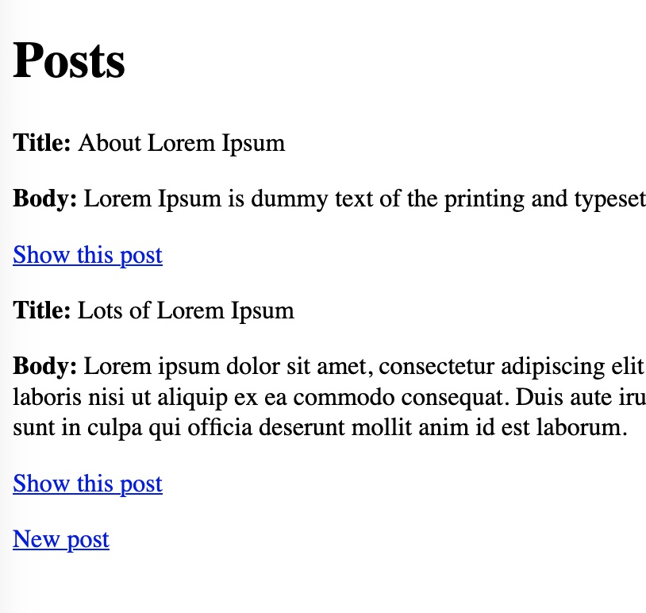

First, let's generate a plain Rails scaffold to serve as a baseline for our
explorations.

A rails app has already been generated in `./example-app/`.

1. Start your rails dev server in a new terminal tab:
   ```
   exec bash -l
   export RAILS_DEVELOPMENT_HOSTS='[[HOST_SUBDOMAIN]]-3000-[[KATACODA_HOST]].environments.katacoda.com'
   cd example-app &&
     rails server -b 0.0.0.0
   ```{{execute T2}}

   View your sample web application by clicking the "Your Web App" tab, or
   open [your development server][dev-server] in a new browser tab.  

   You should see a placeholder page with a Rails logo.

[dev-server]:https://[[HOST_SUBDOMAIN]]-3000-[[KATACODA_HOST]].environments.katacoda.com

2. Generate a scaffold to get you started.  This one is for a very simple
   blog post:
   ```
   rails generate scaffold Post title:string body:text
   rails db:migrate &&
     git add . &&
     git commit -m 'Generate Post scaffold with title and body'
   ```{{execute T1}}

3. Create some posts:
   ```
   rails console
   ```{{execute T1}}
   ```ruby
   Post.create!(title: "About Lorem Ipsum", body: "Lorem Ipsum is dummy text of the printing and typesetting industry.")
   Post.create!(title: "Lots of Lorem Ipsum", body: "Lorem ipsum dolor sit amet, consectetur adipiscing elit, sed do eiusmod tempor incididunt ut labore et dolore magna aliqua. Ut enim ad minim veniam, quis nostrud exercitation ullamco laboris nisi ut aliquip ex ea commodo consequat.  Duis aute irure dolor in reprehenderit in voluptate velit esse cillum dolore eu fugiat nulla pariatur. Excepteur sint occaecat cupidatat non proident, sunt in culpa qui officia deserunt mollit anim id est laborum.")
   ```{{execute T1}}
   ```
   exit()
   ```{{execute T1}}

4. Now visit the [Post controller][posts] and see how it looks...

   Although it may feel like a miracle to have a working application that
   allows you to create and store posts on the server with so little work,
   this UI is very unattractive.  It's not designed for production use, but
   really it's not even all that presentable as a prototype:

   

[posts]:https://[[HOST_SUBDOMAIN]]-3000-[[KATACODA_HOST]].environments.katacoda.com/posts

In the following steps, we'll explore ways of making this first appearance
better.  It will still not match what a designer might produce, but at
least it will be adequate to present a prototype.

* Customize the scaffolded view with bootstrap
* Push our customizations into scaffold templates so that additional
  scaffolds will benefit
* Extract something truly reusable -- a template or even a view component

<!--
   and create a Post or two.  (Click
   "New post".)
  # Or maybe create via seeds?  Depending on whether we want them to see the
  # form part or just the list view.
-->
